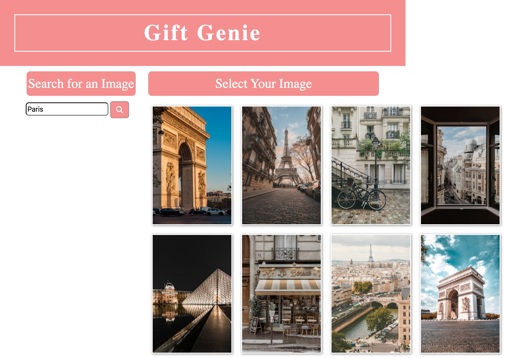
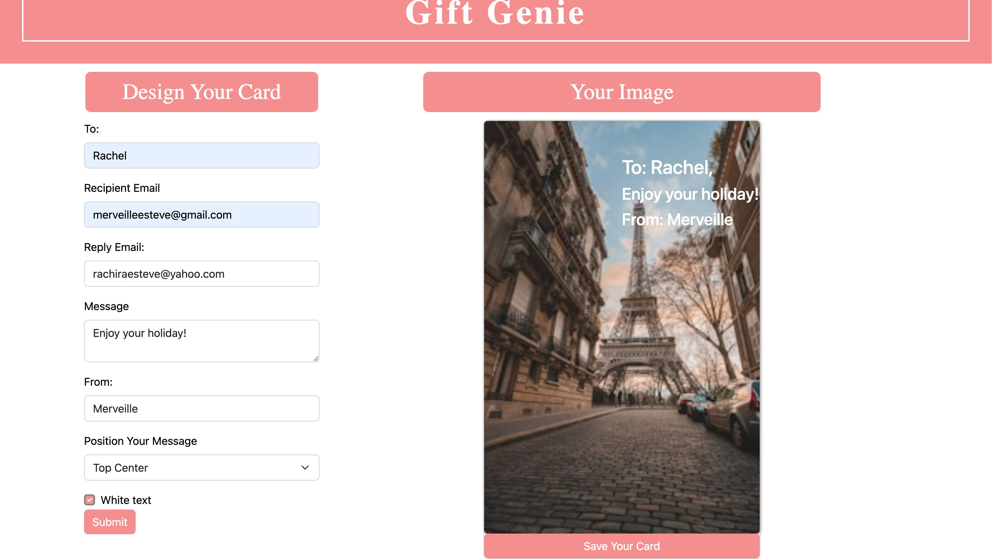
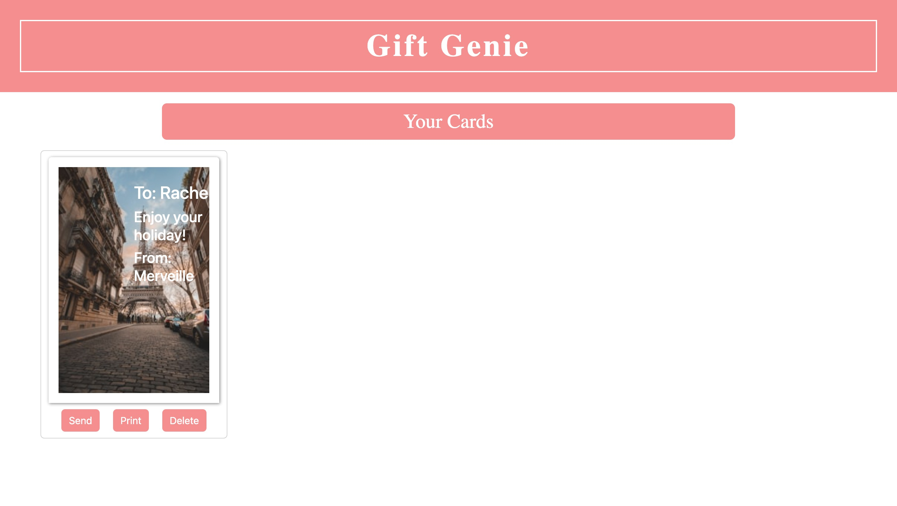

# Gift-Genie

# Description
GiftGenie is a web platform that simplifies creating personalised gift cards for any occasion. Users can choose from various designs add custom messages. With an intuitive interface, GiftGenie makes it easy to create stunning gift cards directly from the web browser, ensuring the perfect present for birthdays, holidays, or special events.

# Project Demo

.gif>)
.gif>)

# Usage
Welcome to Gift Genie! Busy individuals are able to generate a perfect gift card for their loved ones. When a user searches up any key word or theme, my broswer would enable them to generate a picture according to their input. They are also able to add a customisable message to the generated card. This convenient way to create personalised cards for any occasion would take the stress out of last-minute shopping and, also allow users a more personalised feel to their cards!

 * Follow the below steps to generate yourself a gift, get well or a congratulation card(s)!

1. **Search for an image and select your favorite one!**

2. **Now that your favorite image is selected, add a personalised a message!**
The position your message section, allows you to move your message on the card until you read your preferred position. You also have the option to change the text on your page to white or leave it in the default color of black.

3. **You can now view your image + message!**

4. **You also have the option to email, print or delete your final card!**

5. **To start over, all you need to is click on "gift genie"  and you'll be taken back to the first page.**

# Deployed Site

Deployed link: https://raxch23.github.io/Gift-Genie/index.html
